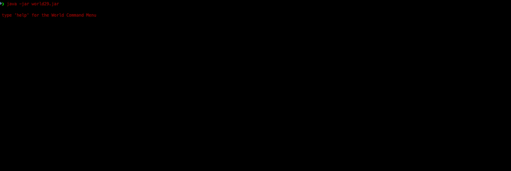

# 

Once upon a time,  
there was a toy robot named "Hal".  
Hal enjoyed teaching little kids how to program and running around in mazes.

One bright sunny day,  
Hal decided to run around in a proceduraly generated maze.  
Poor Hal got so lost he found himself in a strange dark world...

Just as he was about to give up and say: "I am lost" - three robots appear in the distance!  

Hal rushes to them with great joy and says: "Greetings! My name is-"   
_BRRRRAaaaah! SMAsh! BOOOM!_

Bomber-Berri, Sniper-Shaq and Tanker-Titi had reduced Hal to scrap before he could complete his sentence.

The end.

## Contents

1. [Built With](#built-with)

2. [Runs On](#runs-on)

3. [To Play](#to-play)

4. [To Do](#to-do)

5. [Future Fixes](#future-fixes)  

6. [To Test](#to-test)

7. [Player Stats](#player-stats)
 
## Built With

Blood, Sweat and Java.

## Runs On

Earthly devices and a few alien technologies.

## To Play

|  |  | 
| :--: | :--: |
| The World Commandments | The Purge |

|  |  |  |
| :--: | :--: | :--: |
| Bomber-Berri  | Sniper-Shaq  | Tanker-Titi  |

## To Do

* [ ] add safe house maze design  
  
* [ ] collect and display battle stats

## Future Fixes

* look command 
* server package compilation error 

## To Test

Go to the root folder and run
```shell
mvn test
```

## Player Stats

Shaquille Niekerk  
email: sniekerk@student.wethinkcode.co.za  
GitHub: <https://github.com/SniekerkJHB>

Vuyo Titi  
email: vtiti@student.wethinkcode.co.za  
GitHub: <https://github.com/titibot9000>

[See Wiki for detailed info](https://github.com/wtc-cohort-2020/0029-robot-worlds/wiki)
